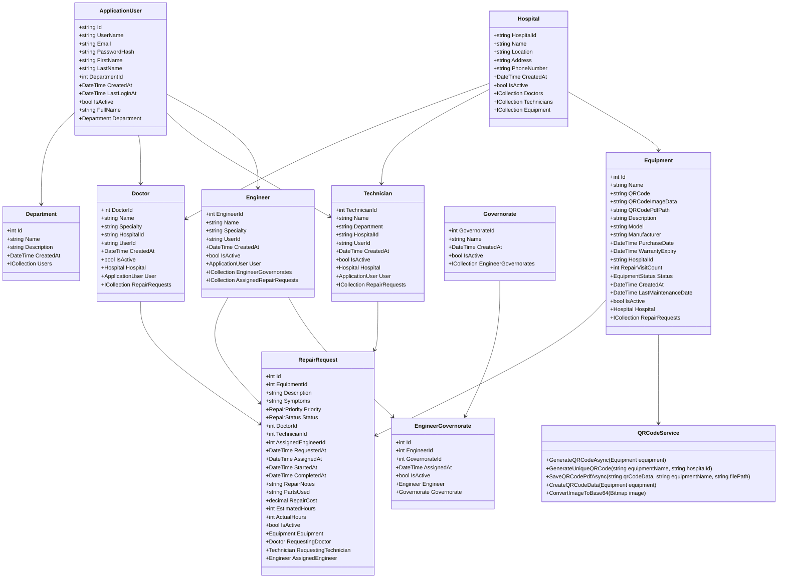

# SoitMed Hospital Management System - Class Diagram

## Overview
This class diagram represents the complete object-oriented structure of the Hospital Management System with QR code generation capabilities.

## Mermaid Class Diagram Code

## Key Features
- **Identity Management**: ApplicationUser with role-based access
- **Hospital Management**: Multi-hospital support with staff management
- **Equipment Management**: Complete equipment lifecycle with QR code generation
- **QR Code System**: Automatic QR code generation, PDF creation, and database storage
- **Repair Management**: Comprehensive repair request workflow
- **Location Management**: Engineer assignment by governorate
- **Service Layer**: QRCodeService for QR code operations

## Generated: September 6, 2025
