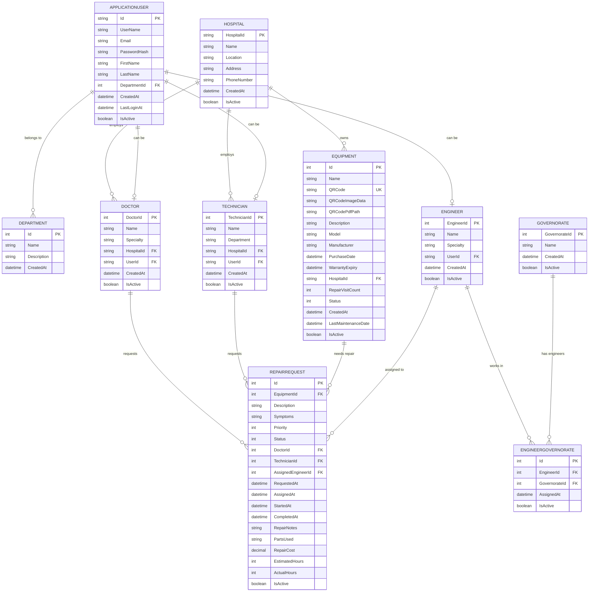

# SoitMed Hospital Management System - Entity Relationship Diagram (ERD)

## Overview
This ERD represents the complete database schema for the Hospital Management System with QR code generation capabilities.

## Mermaid ERD Code

## Database Schema Details

### Core Tables
- **APPLICATIONUSER**: Identity framework users with department assignment
- **DEPARTMENT**: Organizational departments (Administration, Medical, Sales, etc.)

### Hospital Management
- **HOSPITAL**: Hospital entities with location and contact information
- **DOCTOR**: Medical staff associated with hospitals
- **TECHNICIAN**: Technical staff for equipment maintenance

### Equipment Management (QR Code Enhanced)
- **EQUIPMENT**: Equipment with QR code generation capabilities
  - `QRCode`: Unique identifier (format: EQ-{HospitalId}-{EquipmentName}-{Timestamp})
  - `QRCodeImageData`: Base64 encoded QR code image
  - `QRCodePdfPath`: Path to generated PDF file
- **REPAIRREQUEST**: Repair workflow management

### Location Management
- **GOVERNORATE**: Geographic regions
- **ENGINEER**: Field engineers for equipment repair
- **ENGINEERGOVERNORATE**: Many-to-many relationship for engineer assignments

## Key Constraints
- **Primary Keys (PK)**: Unique identifiers for each entity
- **Foreign Keys (FK)**: Referential integrity between related entities
- **Unique Keys (UK)**: QRCode field ensures no duplicate QR codes
- **Check Constraints**: RepairRequest ensures either Doctor OR Technician (not both)

## QR Code System Integration
- Equipment table includes QR-specific fields
- Automatic QR code generation on equipment creation
- PDF storage in `wwwroot/qrs/` directory
- Base64 image storage for API responses

## Generated: September 6, 2025
